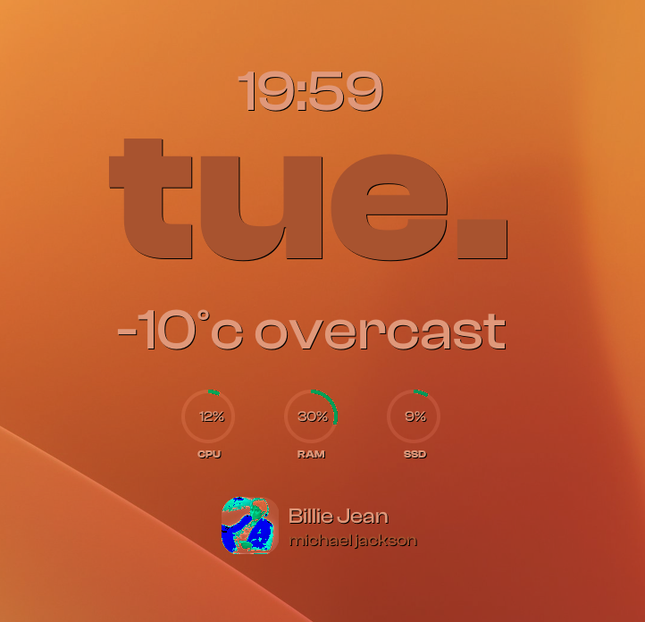

# TERRA UI — виджет Conky для GNOME

TERRA UI — минималистичный Conky-виджет для GNOME с временем, днем недели,динамической погодой, кольцами CPU/RAM/SSD и обложкой Spotify.

> В реальности выглядит лучше, чем на скриншоте. У меня забагался скриншотер :).

## Состав
- [terra-ui.conf](terra-ui.conf) — основной конфиг Conky.
- [weather_smart.py](weather_smart.py) — погода (Open-Meteo) с опциональным авто-определением города.
- [system_rings.py](system_rings.py) — генерация колец CPU/RAM/SSD через Cairo.
- [spotify_cover.py](spotify_cover.py) — обложка и метаданные трека Spotify.
- spotify_covers/ — кэш обложек.
- weather_location.json — кэш координат для погоды.

## Требования
- conky
- python3
- playerctl (для Spotify)
- ImageMagick (команда `convert`)
- python3-psutil
- python3-cairo
- Шрифт: [Clash Display](https://www.fontshare.com/?q=Clash%20Display)(или замените в [my.conf](my.conf))

## Проблемы
Шрифт Clash Display не отображает кириллицу

## Запуск
Из каталога виджета:
- `conky -c my.conf`

Настройка виджетов conky: [how-to-apply-theme](https://malformed-blog.blogspot.com/2025/02/how-to-apply-theme.html)

Рекомендую поставить [Conky Manger](https://github.com/zcot/conky-manager2) для удобного управления виджетами.

Важно: скрипты запускаются относительно текущей папки, поэтому запускайте Conky из директории виджета.

## Настройка

### Основной вид ([my.conf](my.conf))
- `alignment` — позиция на экране (сейчас `middle_middle`).
- `gap_x`, `gap_y` — смещения.
- `minimum_width`, `minimum_height` — размеры окна.
- `color1`, `color2` — основные цвета.
- Блоки вывода:
  - Время: `${time %H:%M}`
  - День недели: `${exec date +%a | tr '[:upper:]' '[:lower:]'}`
  - Погода: `${execi 600 python3 ./weather_smart.py}`
  - Кольца: `${execp python3 ./system_rings.py}`
  - Spotify: `${execp python3 ./spotify_cover.py}` (только если запущен Spotify)

### Погода ([weather_smart.py](weather_smart.py))
- `AUTO_DETECT` — авто-определение координат по IP.
- `DEFAULT_LAT`, `DEFAULT_LON` — координаты по умолчанию.
- `CACHE_FILE` — кэш координат.
- Если включен VPN/Proxy GNOME — авто-обновление координат отключается.

### Кольца системы ([system_rings.py](system_rings.py))
- `RINGS` — список колец и их позиции.
- `THICKNESS` — толщина кольца.
- `COLOR_FG`, `COLOR_BG` — цвета.
- `WIDTH`, `HEIGHT` — размер канвы PNG.
- Позиция картинки регулируется в строке, где -p (x, y):
  - `print(f"${{image {filename} -p 0,390 -s 600x100}}")`

### Spotify ([spotify_cover.py](spotify_cover.py))
- `CACHE_DIR`, `MAX_FILES` — кэш обложек.
- `IMG_POS`, `IMG_W`, `IMG_H`, `RADIUS` — размеры и позиция обложки.
- `TEXT_X` — отступ текста.
- `MAX_LEN_TITLE`, `MAX_LEN_ARTIST` — обрезка текста.
- Требует `playerctl` и доступ к `mpris:artUrl`.

## Типичные проблемы
- **Нет обложки Spotify**: убедитесь, что установлен `playerctl` и запущен Spotify.
- **Нет колец**: проверьте установку `python3-cairo` и `python3-psutil`.
- **Погода offline**: проверьте интернет или включите `DEBUG = True` в [weather_smart.py](weather_smart.py).
